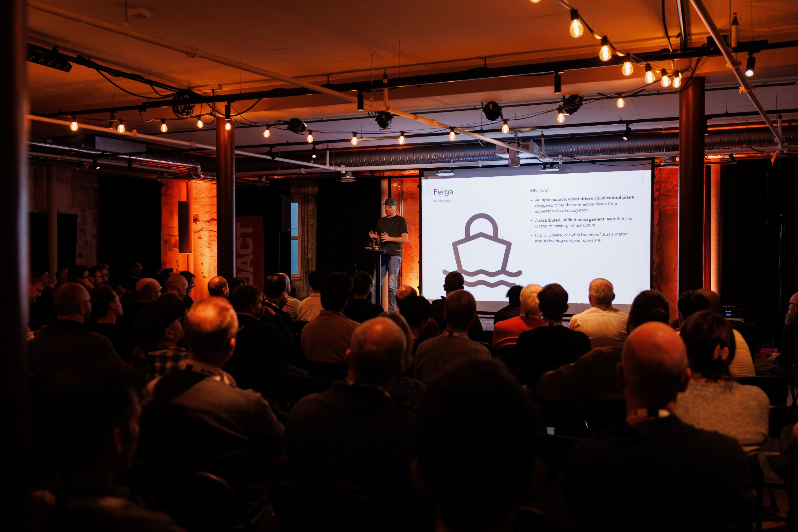
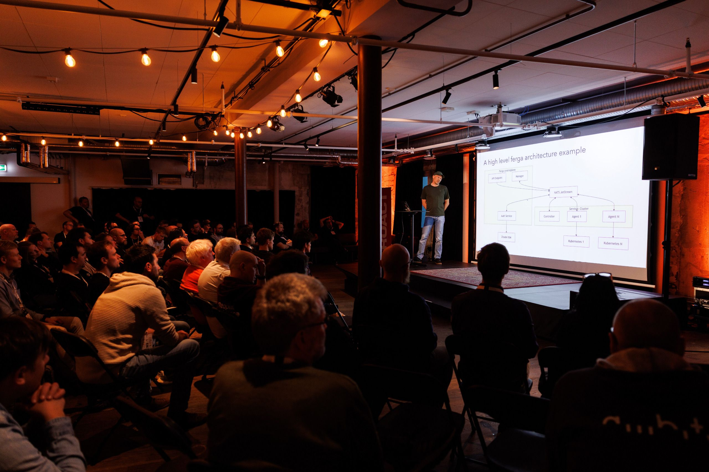
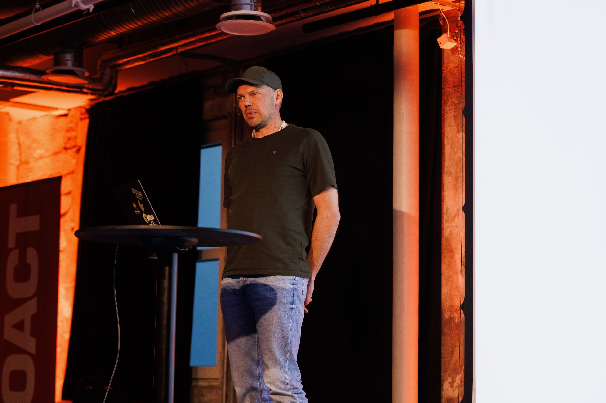
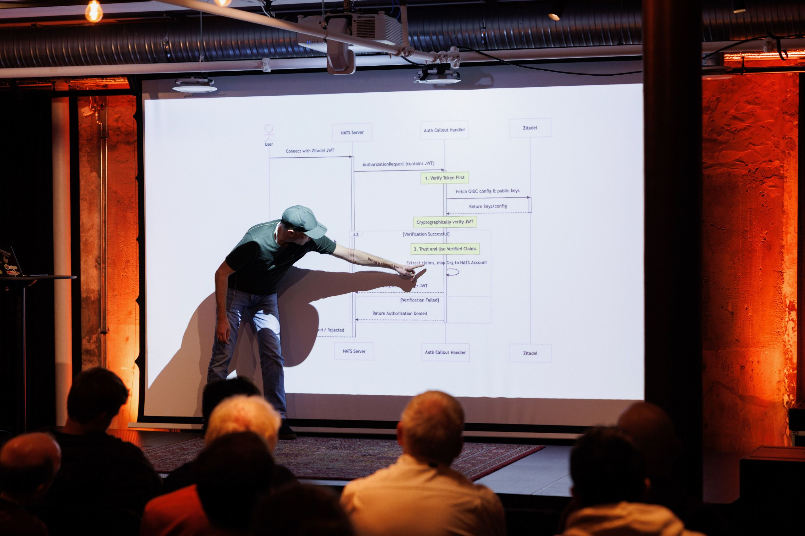
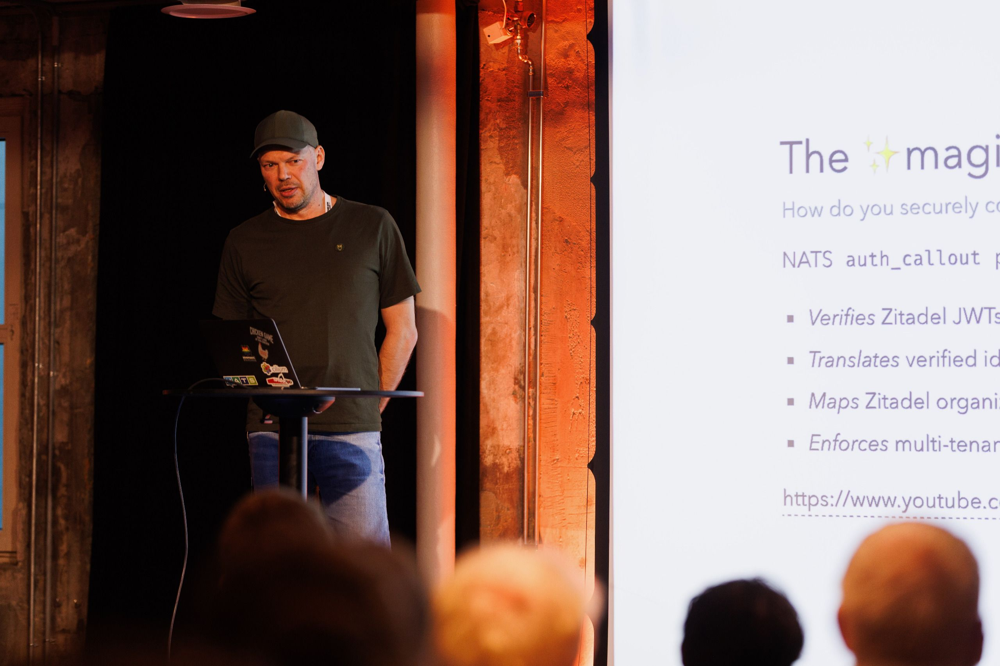



## Om foredraget

| | |
|---|---|
| **Originaltittel** | Building a Sovereign Cloud: What are we missing to solve Norway's digital future? |
| **Konferanse** | [Cloud Native Day Bergen 2025](https://2025.cloudnativebergen.dev/), 27.–28. oktober 2025 |
| **Tidspunkt** | tirsdag 28. oktober 2025, 16:40–17:00 |
| **Rom** | Lillesalen, 2. etasje |
| **Format** | Presentasjon, 20 minutter |
| **Nivå** | Middels |
| **Språk** | Norsk |
| **Spor** | Cloud Infrastructure & Operations, Platform Engineering & Developer Experience |
| **Foredragsholder** | [Jan Ivar Beddari](https://2025.cloudnativebergen.dev/speaker/jan-ivar-beddari), Dataverket |

## Sammendrag

Norge har datasenter i verdensklasse og kompetansen som trengs for å drifte
robuste plattformer som ville utmerket seg på både kostnad og oppetid.
Likevel er vi som nasjon sterkt avhengig av et fåtall globale hyperscalere.
Hvorfor? Hva mangler for å bygge en virkelig suveren, konkurransedyktig og
samlet digital infrastruktur, bit for bit?

Foredraget argumenterer for at den manglende brikken er et samlet, åpent
kontrollplan. Uten en slik felles flate risikerer hvert lokale, private
sky-initiativ å bli en samling fragmenterte og inkompatible tjenester som
ikke kan måle seg med den sømløse opplevelsen hos hyperscalerne.

Med utgangspunkt i erfaring fra bygging av sky-infrastruktur (i Safespring)
utforsker vi dette gapet, og introduserer et åpent, hendelsesdrevet
kontrollplan tenkt som bindevev for et suverent sky-økosystem. Vi ser på
hvordan et slikt kontrollplan gir et sikkert, sporbart og fler-leietakers lag som forener
ulike tjenester, og hvordan denne tilnærmingen direkte adresserer
fragmenteringen og leverandørbindingen som holder oss tilbake.

Sesjonen er en oppfordring til å se forbi private skyer og enkeltplattformer,
og rette fokuset mot de kritiske orkestrerings- og forvaltningslagene som
trengs for å sikre norsk digital framtid. Kontrollplanet ble presentert under
arbeidsnavnet Ferga, og arbeidet med det har vært en direkte forløper til
Dataverket-initiativet.

## Om foredragsholderen

Jan Ivar Beddari har 20 års erfaring med IT-infrastruktur og åpen kildekode.
Teknisk leder for det akademiske IaaS-prosjektet UH-sky, deretter ingeniør og
CTO i Safespring, og senere leder for forskning og utvikling samme sted. Hos
Safespring designet og bygde han hendelsesdrevne kontrollplan for
skyinfrastruktur, den direkte forløperen til Dataverket. Tidligere
sjefsingeniør ved Universitetet i Bergen. Har holdt foredrag på blant annet
Config Management Camp (Gent, 2016) og Cloud Native Bergen (2025).

## Bilder

Foto: Håkon Broder Lund for Cloud Native Bergen, Kulturhuset, 28. oktober 2025.
Se [bilder/README.md](bilder/README.md) for opphav og bruk.

## Lenker

- [Opptak på YouTube](https://www.youtube.com/watch?v=cGCf6mLPxpM)
- [Foredragsholder og sesjon hos Cloud Native Bergen](https://2025.cloudnativebergen.dev/speaker/jan-ivar-beddari)
- [Cloud Native Day Bergen 2025](https://2025.cloudnativebergen.dev/)
