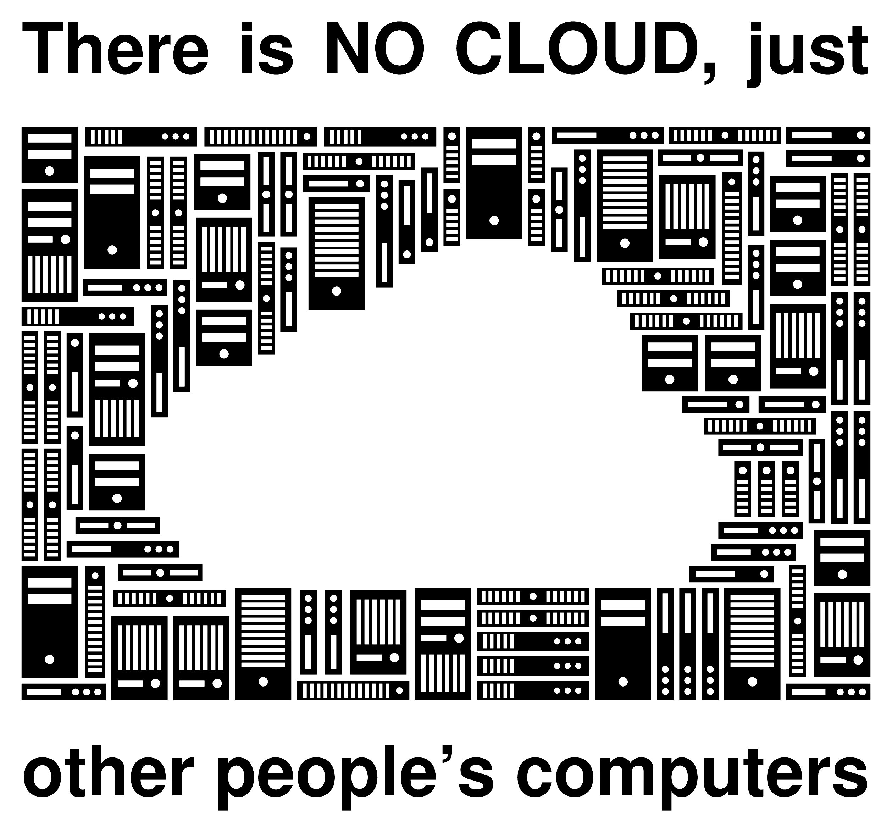

# Norsk sky for alle?

Dataverket - en vei mot et føderert kontrollplan

BLUG | 24. september 2026 | Jan Ivar Beddari

---

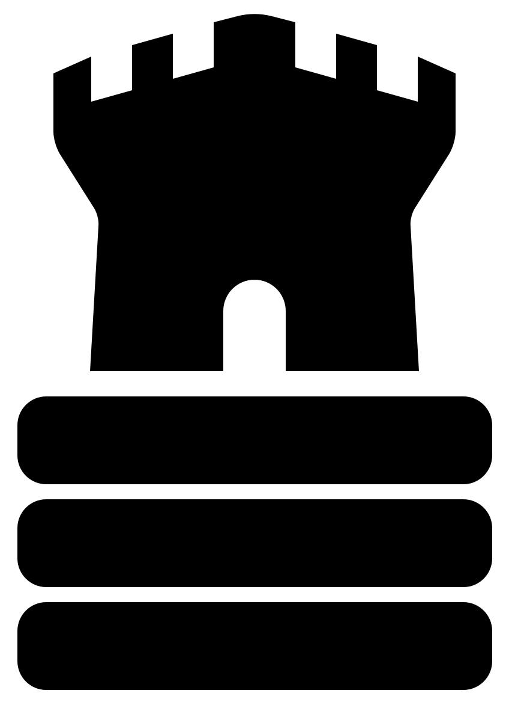

## Hvorfor står jeg her

- UH-sky / NREC: det første norske akademiske skysamarbeidet
- Safespring: ti år, plattformarkitektur, leveranse til EOSC
- Lærdommen: hver operatør bygger de samme lagene, men alene

---

## Laget under plattformene

Virksomheter i Norge har investert mye i åpen kildekode på applikasjons- og plattformlaget, men ...

under dem: _infrastruktur som noen andre leverer_.

---

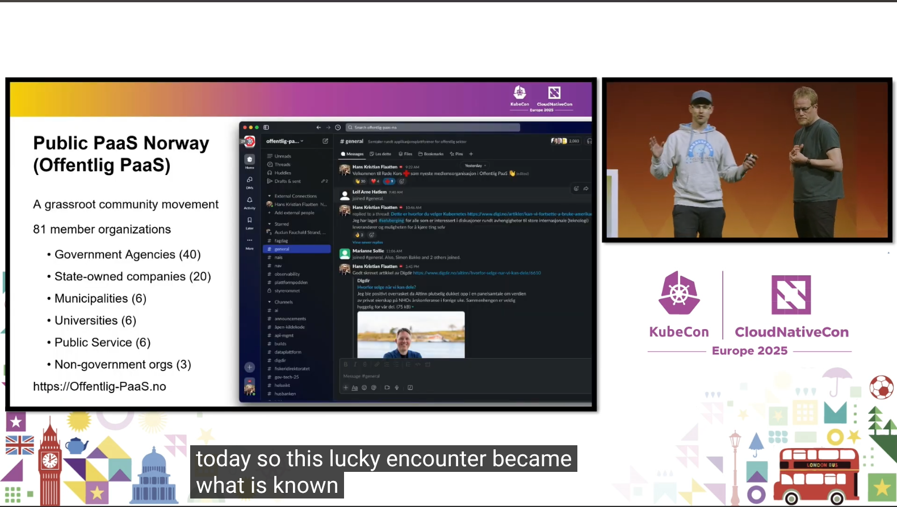

---

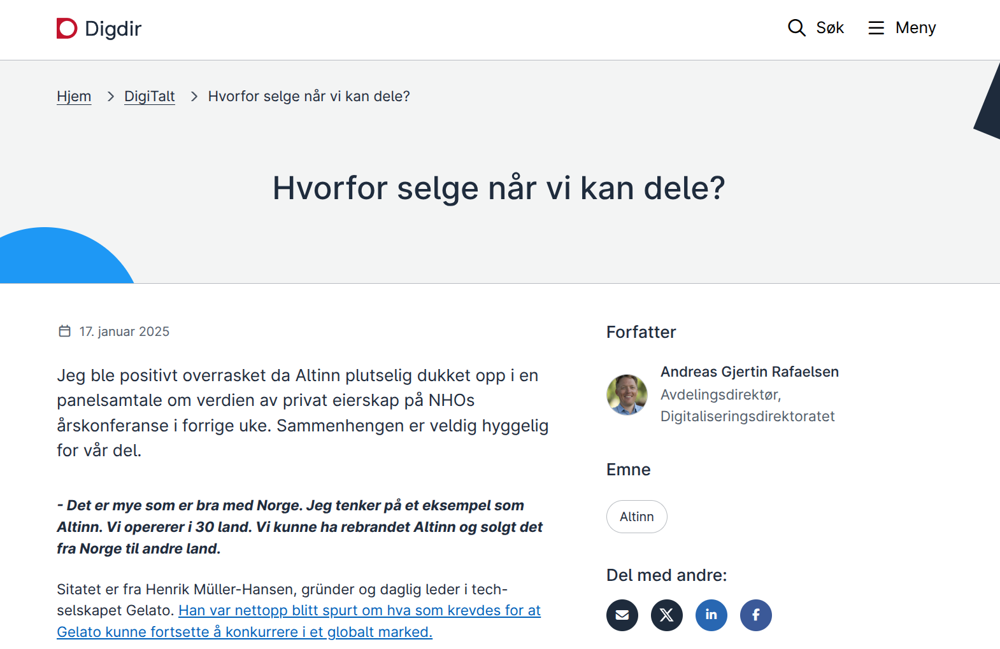

---

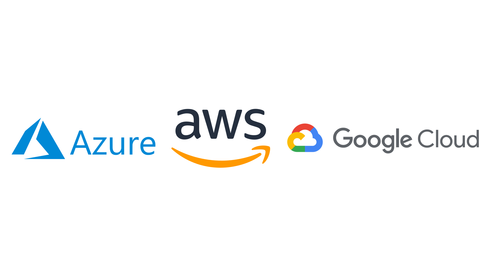

---

https://detsombetyrnoe.no/

---

## Tre spørsmål om norsk sky

1. **Hvilke lover og myndighetskrav gjelder for sky og datasenter?**
2. Hvordan bør et kontrollplan for norsk sky drives?
3. Kan vi samarbeide om felles API, grunnmønster og kode?

---

## Lover, krav og hvem som håndhever dem

| Regelverk | Tilsyn | Treffer |
|---|---|---|
| Sikkerhetsloven | NSM | virksomheter med "skjermingsverdige verdier" |
| Ekomloven og datasenterforskriften | Nkom | alle datasenteroperatører (over 0,5 MW), [registreringsplikt fra 2025](https://nkom.no/datasenter/registreringsplikt) |
| Digitalsikkerhetsloven (NIS), NIS2 på vei | NSM koordinerer, hver sektor har sitt tilsyn | "vesentlige og viktige virksomheter" |
| Cyber Resilience Act (CRA), forordning (EU) 2024/2847 | markedstilsyn, ikke utpekt i Norge ennå | programvare og maskinvare som selges i EU, ikke SaaS |
| Personopplysningsloven (GDPR) | Datatilsynet | alle som behandler personopplysninger |

CRA fikk sitt eget BLUG-foredrag 27. august: ["Hva har (kan) CRA gjort (gjøre) for deg?"](https://www.blug.linux.no/events/2026-08-cra/)

---

| Dokument | Hvem står bak | Treffer |
|---|---|---|
| Cloud Reference Architecture v1.3, mars 2026 | DFØ, markedsplassen for skytjenester | alle som vil selge sky til offentlig sektor i Norge |
| Cloud Sovereignty Framework v1.2.1, oktober 2025 | Europakommisjonen | alle som vil selge sky til EU-institusjonene, laget for Kommisjonens egne anbud |

I Norge, DFØ: kravsett i tre nivåer for skyavtaler, med kobling til ISO 27001, NIST CSF, NSMs grunnprinsipper, CSA CCM, BSI C5 og NIS2.

EU: åtte suverenitetsmål, SOV-1 til SOV-8, og fem nivåer, SEAL-0 til SEAL-4. Poengsummen er tildelingskriterium i anbudet.

Nkom kaller oss datasenteroperatører. DFØ kaller oss skyleverandører. Vi er ofte begge deler.

---

## Krav til kode

Tekniske krav til koden som dokumentene er enige om:
- Alle logger inn ett sted, med MFA. Ingen lokale brukere.
- Alt som gjøres, må logges. Loggen kan ikke redigeres i ettertid.
- Alt er kryptert, også internt. Kunder må eie sine egne datanøkler.
- Vi må spore alle lag i koden. SBOM for hver utgivelse, og ansvar i ti år.
- Minimale angrepsflater. Ikke SSH. Ikke adminporter på internett.

Det aller viktigste: **koden skal kunne kjøres og driftes også uten oss**.
Åpen kode, åpne protokoller, og dokumentasjon som er god nok.

<small>CRA vedlegg I, NSM 2.1, 2.2, 2.3, 2.6, 2.7, 3.2, DFØ B.IS.30–32, CSF SOV-3, -4, -6</small>

---

## Krav til drift

Operatørens jobb, uansett hvilken kode som kjører:
- Driver du datasenteret: registrer deg hos Nkom før du starter.
- Ha et styringssystem, og gå gjennom det hvert år. Ny risikovurdering hver gang noe endres.
- Vit hvem som har tilgang. Roller, med et navn bak hver. Tidsbegrenset.
- Logg hvem som ser kundedata. Ta vare på loggen. Lever den ut når kunden ber om det.
- Ta backup ut og langt bort. Test at den kan leses og gjenopprettes.
- Følg opp leverandørene dine, også de i utlandet.

Vær klar til å kjøre alt fra Norge, med personell i Norge, hvis Nkom sier det.

Avvik: Nkom med en gang, kunden innen et døgn, rapport innen tre.

<small>ekomloven § 3-7, datasenterforskriften kap. 2, NSM 2.9, DFØ A.6, B.IS.7, B.IS.24, B.IS.33–37</small>

---

## Sertifisering: det kjøperne spør etter

| Nivå | Hva | Hvem krever det |
|---|---|---|
| Basis | ISO 27001 | DFØ krever den, Nkom og NSM viser til den |
| Skytjenester | ISO 27017, CSA CCM, BSI C5, SOC 2 type 2 | DFØ B.IS.1, B.IS.3 |
| Produkt | CRA-samsvar og CE-merking | markedstilsyn fra 11. desember 2027 |
| Suverenitet | Cloud Sovereignty Framework, SEAL-0 til SEAL-4 | EU-anbud, poengsum |

Vanlig å ha i tillegg: ISO 27018 for personvern i skyen.

Fri programvare kan bruke egenerklæring (modul A) i CRA hvis den tekniske dokumentasjonen er offentlig (artikkel 32 nr. 5).

Digitalsikkerhetsloven krever ikke sertifisering, men registrering. NIS2 skjerper dette når den kommer. Rapporteringsplikten i CRA gjelder allerede, siden 11. september.

**Lista over krav er lang og blir lengre. Og den er lik for alle.**

---

## Les dokumentene selv

Alle dokumentene ligger i org-repoet på [git.dataverket.org](https://git.dataverket.org/dataverket/org/src/branch/main/docs/forankring), mappa `docs/forankring`.

- [NSMs grunnprinsipper for IKT-sikkerhet v2.1](https://git.dataverket.org/dataverket/org/src/branch/main/docs/forankring/nsm-grunnprinsipper-ikt-sikkerhet-v2.1.pdf)
- [Nkoms datasenterveileder](https://git.dataverket.org/dataverket/org/src/branch/main/docs/forankring/datasenterveileder-nkom.pdf)
- [CRA, forordning (EU) 2024/2847](https://git.dataverket.org/dataverket/org/src/branch/main/docs/forankring/cra-eu-2024-2847.pdf)
- [DFØ MPS Cloud Reference Architecture v1.3](https://git.dataverket.org/dataverket/org/src/branch/main/docs/forankring/dfo-mps-cloud-reference-architecture-v1.3.pdf)
- [EU Cloud Sovereignty Framework](https://git.dataverket.org/dataverket/org/src/branch/main/docs/forankring/Cloud-Sovereignty-Framework.pdf)

DFØ sitt rammeverk for skybaserte infrastruktur- og plattformtjenester, kapittelet [Sikkerhet og compliance](https://markedsplassen.anskaffelser.no/fagomrader/cloud-infrastructure-and-platform-services-cips/rammeverk-cips/sikkerhet-og-compliance). Det finnes bare som nettside.

---


**["Compliance is not survival"](content/nonog-2026-09-faltstrom.pdf)**

Patrik Fältström, Netnod, på NONOG i Oslo 9. september 2026.

Netnod har som oppdrag å holde svensk tid presis i månedsvis uten kontakt med omverdenen.

Det jeg tok med meg: tjenester som er viktige for samfunnet må designes for **overlevelse**, uten hyperscalere, uten leverandørstøtte, og med tilstrekkelig mange forskjellige virksomheter og mennesker.

---

## Tre spørsmål om norsk sky

1. Hvilke lover og myndighetskrav gjelder for sky og datasenter?
2. **Hvordan bør et kontrollplan for norsk sky drives?**
3. Kan vi samarbeide om felles API, grunnmønster og kode?

---

## Regnestykket (lysbildet for ledelsen!)

Identitet. PKI. Hendelseslogg. SBOM. Sårbarhetshåndtering. Rapportering Sikkerhetskopi.

- Alt må finnes fra første kunde, og alt må vedlikeholdes.
- Hyperscalerne har betalt for dette én gang, men de deler det ikke.
- En norsk operatør må betale det selv, eller miste tilgangen til markedet.

Kommuner som kjøper Google Classroom svarer selv for at det er trygt, men de benytter (forhåpentligvis) deler av det vi har gått gjennom her som grunnlag.

**Et sky-kontrollplan som oppfyller kravene er svært dyrt for én leverandør.**

---

## Kontrollplanet kan drives med felles kode og felles rammeverk

- Utviklet, driftet og vedlikeholdt av norske operatører
- Hver operatør tilbyr samtidig egne tjenester, under egen myndighet
- Åpen kildekode, AGPL v3

**Del koden og dokumentasjonen, men konkurrer om leveransen!**

---

## Et "FEIDE for infrastruktur"?

- FEIDE: institusjonene eier identitetene, staten driver rammeverket
- Dataverket: operatørene har kunder og tjenester, et _samvirke_ driver rammeverket

I et slikt oppsett ville ikke federasjon av _tjenester_ være et krav, men det kunne være en mulig risikoreduksjon.

---

## Gjør jobben én gang, felles for alle

Arkitektur og åpen kildekode kan gjenbrukes hvis prinsippene er felles!

- Én tilgangsmodell, én ting å revidere: "Dataverket Identitiet"
- Auditlogg på tvers, standardisert
- SBOM og sårbarhetshåndtering i én kodebase, ikke i ti
- Teknisk forankret én gang mot NSM, Nkom, CRA, EU CSF og DFØ MPS, og hva som måtte komme seinere.

ISO 27001 og NIS2 blir billigere.

Kan Norge 🇳🇴 blir mer konkurransedyktig? Kan tjenestene våre bli mer suverene?

---

## Ideen om et samvirke

Dataverket som et produksjonssamvirke:
- operatører utvikler og vedlikeholder kode og plattform
- felles investering og felles veikart
- demokratisk styrt, en virksomhet, én stemme

Et slik samvirke **eier ikke kapasitet** og **selger ikke tjenester**.

All kode og dokumentasjon er åpen kildekode (AGPLv3 og CC BY-SA 4.0) og bidragsyterne eier den selv. Ingen kan lukke den, heller ikke samvirket selv.

---

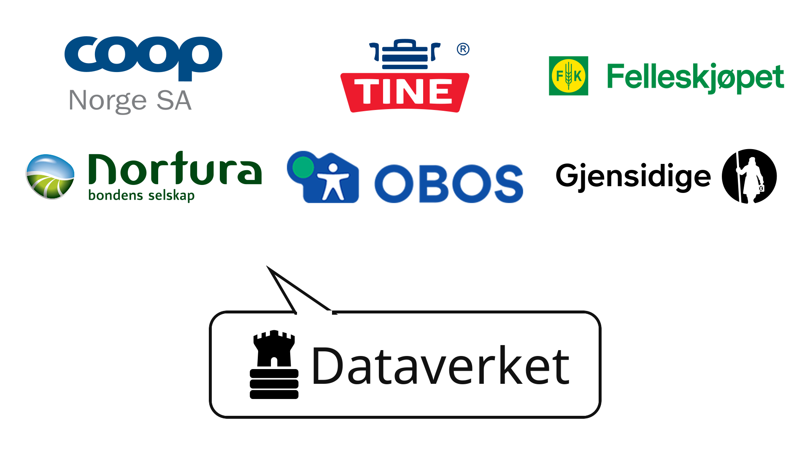

---

## Tre spørsmål om norsk sky

1. Hvilke lover og myndighetskrav gjelder for sky og datasenter?
2. Hvordan bør et kontrollplan for norsk sky drives?
3. **Kan vi samarbeide om felles API, grunnmønster og kode?**

---

## Teknisk er det enkelt 😈

Vi trenger ikke finne opp noe, og public cloud er mønsteret: Identitet, meldinger, ressurs-ID-er, og policy.

Vi kan bygge det samme, men åpent: åpen kode, åpne protokoller, åpen dokumentasjon.

Det er ordrett det EUs suverenitetsrammeverk ber om.

---

## Lavest mulig kostnad som prinsipp

Vedlikeholdskostnad er antall ganger du *må* røre koden. Dataverket velger den enkleste designen. Det er også den billigste.

| | Go, scratch | npm, node:alpine |
|---|---|---|
| Kildelinjer i runtime | 0,7 mill. | 6,1 mill. |
| Advisories fra september 2025 til i dag | 33 | 59 |
| **Som faktisk kalles i koden** | 5 | ukjent, så alle |

<small>⚠️ Uvitenskaplig LLM-basert måling av samme kodefunksjonalitet i to runtime-trær med pakker, basert på kodekonsept for Dataverket:
Kjøremiljøet i begge tilfellene er det samme, Talos k8s. Hvis du skriver koden i nodeJS må du oppdatere containeren inntil 59 ganger 💸💸💸</small>

---

## Kjernearkitektur: Dataverket Identitet

Autentisering:
- én organisasjon er ett sikkerhetsdomene.
- mennesker og maskiner er principals, med roller per tjeneste.
- rollene kommer fra Dataverkets vokabular, konfigurert inn over API. Backenden knyter sammen rollene, men den definerer dem ikke.

Zitadel er første backend i implementasjonen. Keycloak?

---

## Kjernearkitektur: Dataverket Sentral

Autorisasjon, meldinger, regler og katalog:
- ett sikkerhetsdomene er en meldingskonto, kryptografisk adskilt:
    - meldingskonto for brukere og maskiner fra hver organisasjon
    - meldingskonto for hver tjeneste
- en regelmotor bestemmer hvilke meldingsemner hvert principal kan sende eller motta (pub/sub)
- en tjeneste i Dataverket registrerer seg som tilgjengelig i en sentral katalog

Sentral blir implementert ved hjelp av meldingssysemet https://nats.io

---

## Kjernearkitektur: Flyten

Sentral har API mot Identitet for å håndtere roller og tilganger for mennesker og maskiner.

Først kobler en klient (principal) til Identitet og får et token som kan benyttes for å koble til Sentral. I Sentral avgjøres rettighetene og dersom meldingen er OK i regelfilteret blir den sendt over NATS til alle tjenester som eventuelt lytter etter den, basert på emnet i meldinga.

Alle meldinger er standardisert som CloudEvents. Kommandoer, hendelser, spørringer og svar. Alle ressurser har en global ID som kan uttrykkes i reglene.

Hva en melding har lov til å gjøre blir derfor bestemt av "konvolutten" den ligger i, ikke av selve innholdet i meldingen.

---

## Innslipp, del 1: autentisering

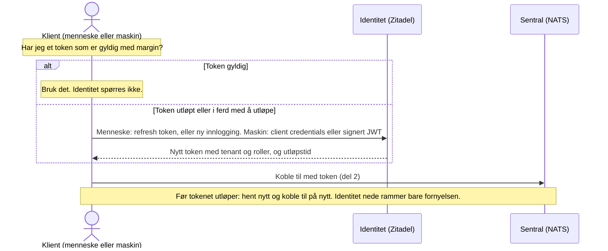

---

## Innslipp, del 2: autorisasjon

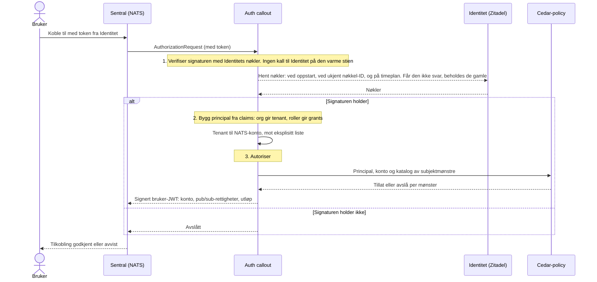

---

https://docs.digdir.no/docs/Maskinporten/maskinporten_protocol_token.html

```
{
  "access_token" : "eyJraWQiOiJhdC1rZXktaWQiLCJhbGciOiJSUzI1NiJ9.eyJpc3MiOiJodHRwczovL21hc2tpbnBvcnRlbi5uby8iLCJzY29wZSI6ImRpZml0ZXN0OnRlc3QxIiwiZXhwIjoxNzAwMDAwMDAwLCJpYXQiOjE2OTk5OTk0MDB9.signature",
  "token_type" : "Bearer",
  "expires_in" : 599,
  "scope" : "difitest:test1"
}
```

---


## Litt mer oversiktlig?

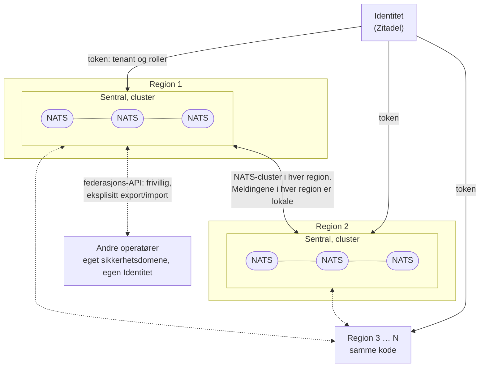

---

## Mulige tjenester i en region (dine tjenester?)

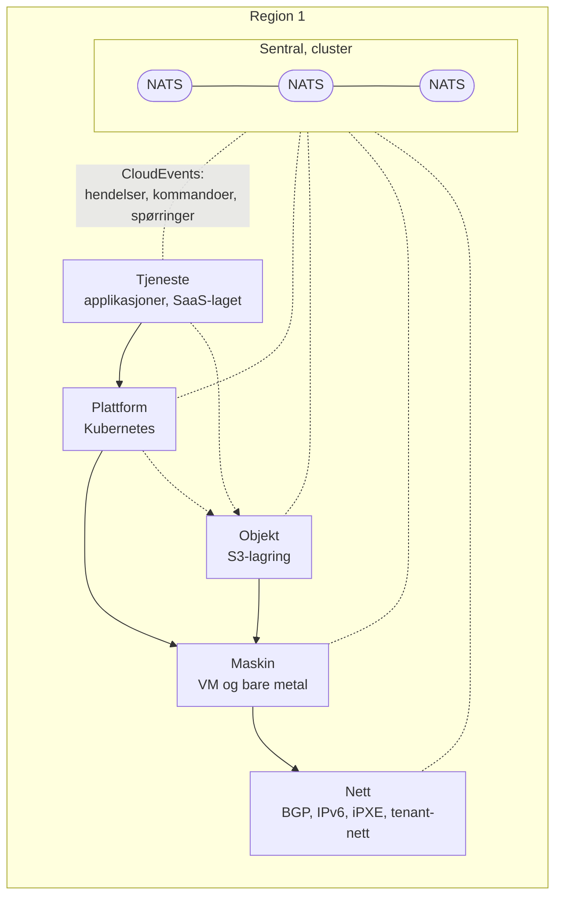

---

## Under planlegging: Nett og Maskin

Suveren bare metal og KI-cluster med selvbetjenings-API.

Prøver å selge dette nå i høst, men så langt vil ingen kjøpe 😅

(sidequest: [«We are all product engineers now»](https://seldo.com/posts/we-are-all-product-engineers-now/), Laurie Voss, 14. september 2026)

---

## Kjør Dataverket hjemme (kommer snart!!!)

- **Laptop**: Dataverket alt-i-ett.
- **Hjemmelab**: Fire små servere og en svitsj.
- **Datasenter**: Skalerbart referansedesign, 1-50 rack, 1-N regioner.

Samme komponenter, kode og metodikker for hver skala.

---

## Dataverket trenger hjelp!

Vi trenger hjelp, så om du er engasjert for teknisk suverenitet, bli med!

**Du kan påvirke retningen og resultatet!**

---

## To retninger: kunnskap og kode

**Kunnskap**: samle det vi kan, forklare det, forankre det

- nettstedet dataverket.org: tekst, struktur, korrektur, flere øyne
- **blogg**: skriv et innlegg, og start diskusjonen den veien
- erfaring fra anskaffelser, drift og compliance
- vedtekter: samvirkelov, medlemsbalanse, federasjonsrollen

**Kode**: bygge, drifte selv

- **Zulip** for diskusjon og organisering: den skal opp, og noen må sette den opp
- NATS, Zitadel, iPXE, BGP, Talos
- hjemmelab: kjør plattform og kode fortell oss hva som brekker

Du trenger ikke begrense deg til bare en retning, hehe.

---

## Tre kodeoppgaver

**frr som egen IncusOS-app**, middels, [discuss.linuxcontainers.org/t/27244](https://discuss.linuxcontainers.org/t/27244)

IncusOS go-bgp kan ta imot ruter men installerer ingen av dem, så vi får ikke BGP-til-host slik vi ønsker. Stéphane Graber foreslår en egen app som peerer med go-bgp over localhost og eier rutingen på verten. Ja takk!

**security.acls på routed NIC**, trolig lett, [discuss.linuxcontainers.org/t/27246](https://discuss.linuxcontainers.org/t/27246)

Virker på bridged og OVN nic i dag, men routed har bare RP-filter. Firewall-grensesnittet mangler et `InstanceSetupRoutedFilter`, og ACL-til-nft-koden kan trolig gjenbrukes som den er.

**Én Forgejo-runner per organisasjon for git.dataverket.org**, åpen

Studere, dokumentere og bygge: hvordan bør vi gi hver organisasjon en "sikker" runner, isolert med Talos og Kata/QEMU?

---

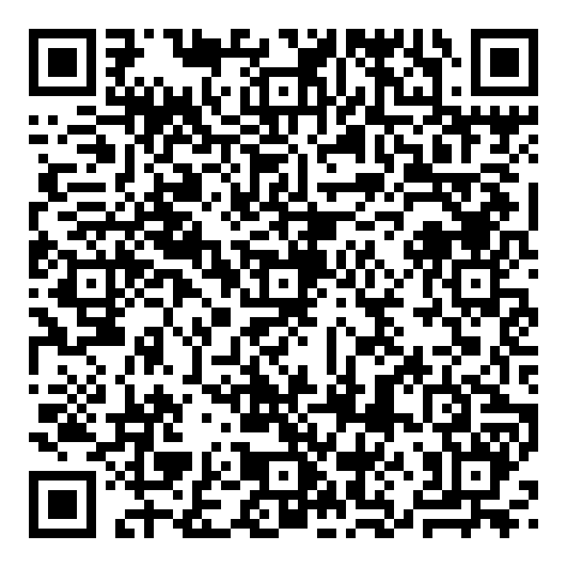

## Bli med nå i kveld!

**Skann koden og bli med i Signal-gruppa.** Det er der koordineringen skjer akkurat nå.

Eller om du heller vil det, send en epost til medlem@dataverket.org og fortell hva du kan!
