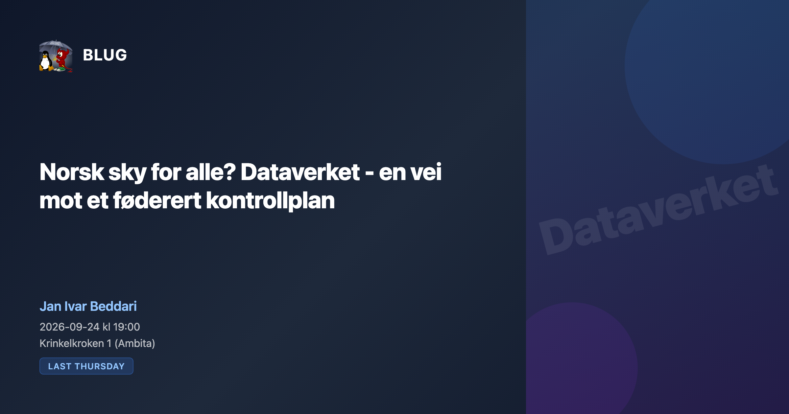

## Om foredraget

| | |
|---|---|
| **Full tittel** | Norsk sky for alle? Dataverket – en vei mot et føderert kontrollplan |
| **Arrangør** | [Bergen (BSD and) Linux User Group](https://www.blug.linux.no/), møteserien «Last Thursday» i samarbeid med Ambita |
| **Tidspunkt** | torsdag 24. september 2026, 19:00–21:00 |
| **Sted** | Auditoriet til Ambita, Krinkelkroken 1, Bergen |
| **Språk** | Norsk |
| **Foredragsholder** | Jan Ivar Beddari, Dataverket |
| **Manus** | [foredrag.md](foredrag.md) i samme mappe |

## Sammendrag

Norge har sterke åpne plattformer på applikasjonslaget, men de bygger alle
stort sett på en infrastruktur noen andre leverer. Med digital suverenitet,
NIS2 og sikkerhetsloven på agendaen står laget under med et stort
spørsmålstegn: hvem driver kontrollplanet for sky og datasenter, under hvem
sin administrative myndighet, og hvordan kan flere norske operatører spare
tid og penger ved å dele samme grunnmønster uten å sentralisere makt?

Foredraget presenterer Dataverket, et kontrollplan med sikkerhet forankret i
transportlaget (NATS), i identitet (Zitadel) og i uforanderlige
operativsystem (Talos, IncusOS). Jo færre linjer kode, jo billigere
vedlikehold over tid. Erfaringen er at dette faktisk stemmer.

Visjonen er et «FEIDE for infrastruktur»: federert mellom norske operatører,
ikke sentralisert hos én. Vi ser på arkitekturpremissene, hvorfor de gjør
sertifisering mot for eksempel ISO 27001 og NIS2 vesentlig billigere enn
dagens alternativer, og hva som skal til for at det norske
åpen kildekode-fellesskapet kan bygge dette sammen.

## Om foredragsholderen

Jan Ivar Beddari er åpen kildekode-entusiast bosatt i Volda, med 20 års
erfaring fra norsk og europeisk skyinfrastruktur. Han var teknisk drivkraft i
etableringsfasen av UH-sky / NREC, og har deretter hatt mange roller i ti år
hos den europeiske skyleverandøren Safespring. Han ledet moderniseringen av
plattformarkitekturen og bygde leveransen til European Open Science Cloud
(EOSC). I 2026 startet han prosjektet Dataverket, et åpent kontrollplan for
datasenter- og skyinfrastruktur. Han snakket om suveren norsk sky på
[Cloud Native Bergen 2025](../2025-10-28-cloud-native-bergen/).

## Praktisk

Møtet holdes i auditoriet til Ambita i Krinkelkroken 1. Noen står i døra fra
omtrent 18:50 til 19:00 for å slippe folk inn, og det henges opp en lapp med
et telefonnummer du kan ringe om du kommer senere.

## Lenker

- [Arrangementet hos BLUG](https://www.blug.linux.no/events/2026-09-dataverket/)
- [Plakaten](content/plakat-blug-2026-09.png) er laget av BLUG og hentet fra samme side
