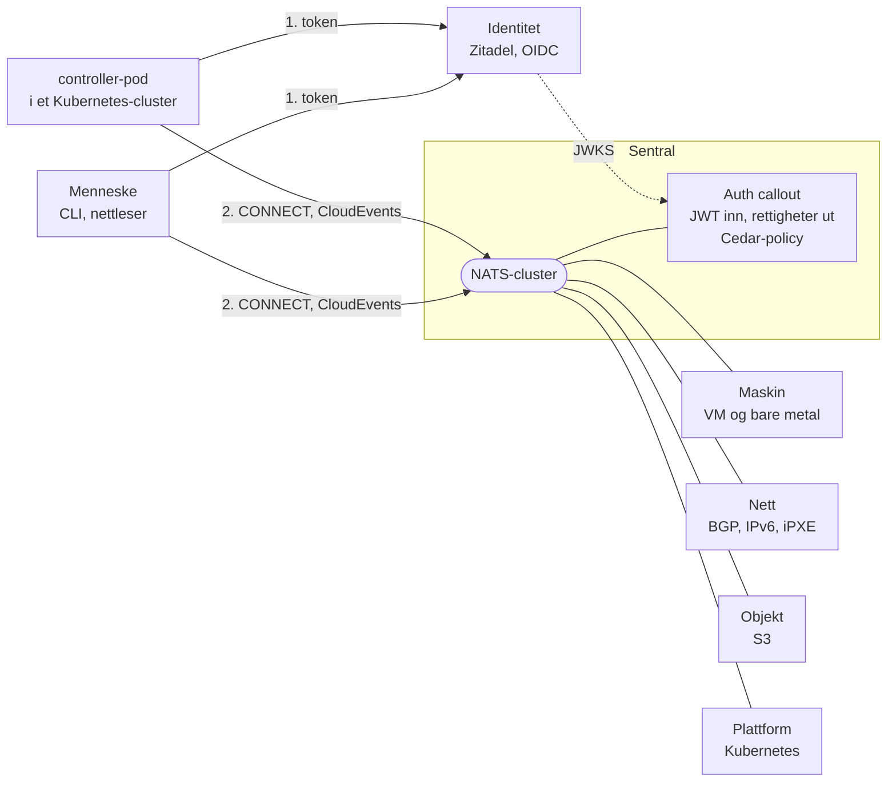
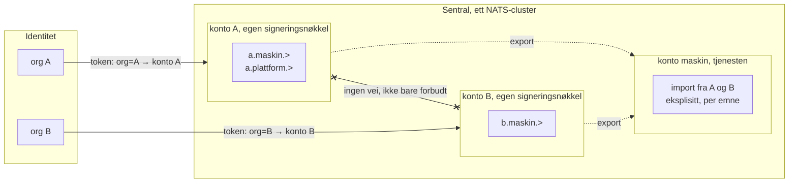
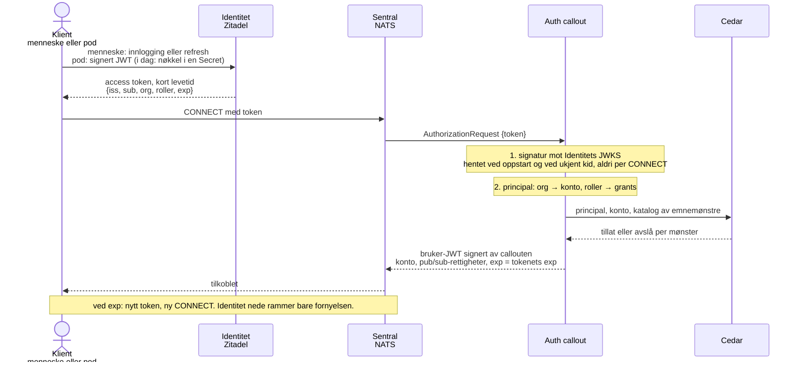
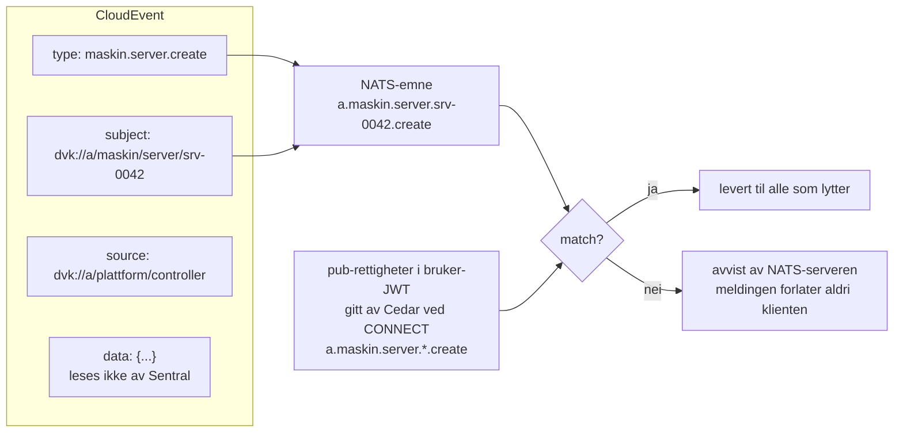
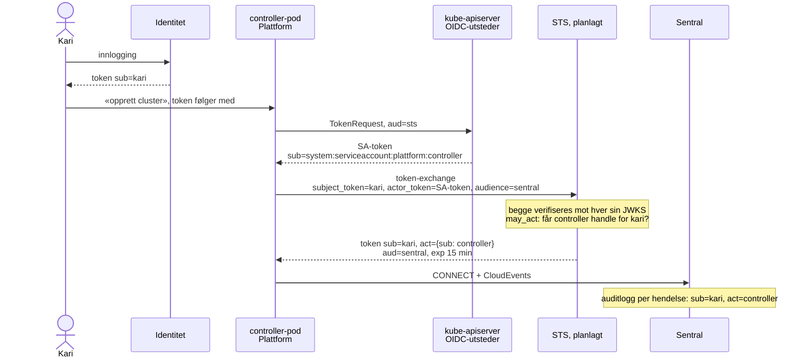
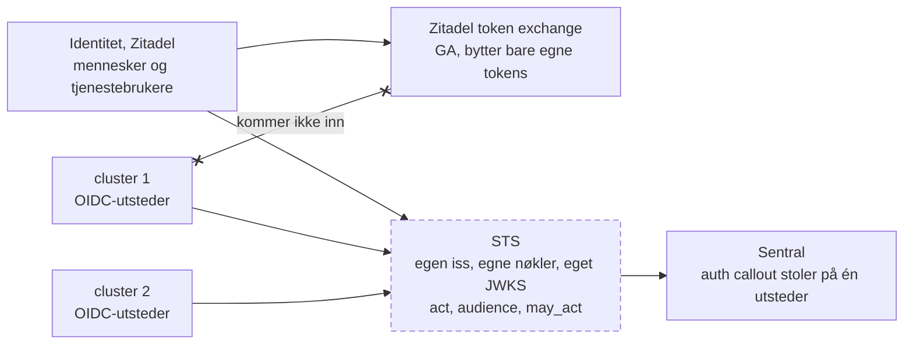

<!--
Skjelett. Tidsbudsjett, 45 minutter:
  0–5    Innledning, begge
  5–22   Kontrollplanet, Jan Ivar
  22–34  Salmon, Linus
  34–36  Ønskelisten, begge
  36–44  Spørsmål dem imellom: først tre om Salmon fra Jan Ivar, så tre om Dataverket fra Linus
  44–45  Publikum, eller avslutt
Skilleark har class skille, Q&A-bildene class sporsmal.
-->

# Maskiner som logger inn

Maskinidentitet, delegering og tillit med åpen kildekode

Containerkonferansen | Trondheim, 14. oktober 2026 | Jan Ivar Beddari og Linus Johansen

---

<!-- _class: skille -->

## Hvem er denne maskinen, og på vegne av hvem handler den?

Innledning, 5 minutter, begge

---

## Hvem er vi

- Jan Ivar: Dataverket, et åpent kontrollplan for suveren skyinfrastruktur
- Linus: salmon, en identitetsleverandør for mennesker og arbeidslaster

---

## Hvorfor spørsmålet haster nå

- En controller oppretter, sletter og flytter uten at noen trykket på en knapp
- En agent kaller API-er med credentials den fikk av noen, en gang
- Auditloggen sier *hva* som skjedde og *hvilken maskin* som gjorde det

Den sier sjelden **på vegne av hvem**.

<small>Kubernetes-operatorer, GitOps-controllere, CI-runnere og LLM-agenter er alle maskiner som handler for et menneske som ikke er til stede.</small>

---

## Tre spørsmål

1. **Tenant-isolasjon**: kan kryss-trafikk gjøres kryptografisk umulig, ikke bare forbudt?
2. **Innlogging uten hemmeligheter**: kan kortlevde tokens erstatte statiske credentials?
3. **Delegering**: kan en maskinhandling spores tilbake til et menneske?

---

<!-- _class: skille -->

## Kontrollplanet

Jan Ivar, 17 minutter

---

## Dataverket på ett bilde

<!--
Premissene først, så bildet.
- Alle logger inn ett sted. Ingen lokale brukere, ingen langlevde nøkler.
- Alt som gjøres må logges, og loggen må peke på en identitet.
- Én organisasjon er ett sikkerhetsdomene, kryptografisk, ikke ved policy.
- Koden skal kunne kjøres og driftes uten oss.
Kravene er de samme som i NSM 2.1, 2.6, 2.7, CRA vedlegg I og DFØ B.IS.30–32. Vi bygger dem inn, ikke oppå.

Bildet: Go, AGPL v3. Meldinger over NATS, alle som CloudEvents. Identitet er Zitadel i dag.
To principals til venstre: et menneske og en controller-pod. Begge henter token fra Identitet, begge kobler til Sentral på samme måte. Plattform er Kubernetes, så dere er allerede i bildet.
-->

---

## Én organisasjon er ett sikkerhetsdomene

<!--
Spørsmål 1: kan kryss-trafikk gjøres umulig, ikke bare forbudt?
- En NATS-konto har egen signeringsnøkkel. Et emne i konto A finnes ikke i konto B.
- Hver organisasjon i Identitet blir én konto for mennesker og maskiner.
- Hver tjeneste har sin egen konto, og importerer eksplisitt, emne for emne.
- Ingen policy å glemme, ingen regel som kan skrives feil.
I Kubernetes stopper NetworkPolicy trafikken. Her finnes det ingen trafikk å stoppe.
Kontoen er grensen. Auth callout bestemmer hvem som slipper inn i den, neste bilde.
-->

Kubernetes: namespace er en policy-grense. NATS: konto er en nøkkelgrense.

---

## Innslipp: fra token til tilkobling

<!--
Spørsmål 2: kan kortlevde tokens erstatte statiske credentials? Slått sammen fra de to BLUG-diagrammene.
Callouten gjør lite, med vilje:
- Verifiserer signaturen mot Identitets JWKS, hentet ved oppstart og ved ukjent kid. Aldri per CONNECT.
- Bygger principal fra claims: org gir konto, roller gir rettigheter.
- Spør Cedar: hvilke emnemønstre får denne principalen publisere og abonnere på?
- Svarer NATS med en signert bruker-JWT som utløper når tokenet utløper.
Ingen kall til Identitet på den varme stien. Identitet nede rammer bare fornyelsen.
Mennesker har ingen hemmeligheter å rotere. Poder har det fortsatt: i dag en signert JWT med nøkkel i en Secret. Det er hullet, og vi kommer dit.
Cedar er policyspråket, samme som i Salmon.
-->

---

## Konvolutten bestemmer, ikke innholdet

<!--
Emne- og ID-formatet er illustrasjon, ikke vedtatt.
- Kommandoer, hendelser, spørringer og svar, samme konvolutt. CloudEvents 1.0.
- Alle ressurser har en global ID som kan stå i en regel.
- Emnet utledes av konvolutten, og rettighetene er emnemønstre gitt ved CONNECT.
- Sentral leser aldri data. Den trenger ikke å forstå tjenesten for å beskytte den.
Auditloggen er konvolutten pluss principalen. Den finnes før tjenesten har sett meldinga.
Samme mønster som RBAC: avgjørelsen tas på verb, ressurs og namespace, ikke på spec.
-->

RBAC avgjør på verb, ressurs og namespace. Sentral avgjør på type, ressurs-ID og org.

---

## Delegering med RFC 8693

<!--
Spørsmål 3: kan en maskinhandling spores tilbake til et menneske? Operatormønsteret: en controller handler på vegne av Kari.
- sub er mennesket. act er maskinen som handler for det. Kjeden kan nestes: controller for pipeline for Kari.
- may_act sier hvem som får handle for hvem, bestemt der tokenet byttes.
- 15 minutters levetid. aud er mottakeren, ikke utstederen.
Poden trenger ingen Secret. TokenRequest gir et kortlevd SA-token med den audiencen vi ber om, og clusterets egen OIDC-utsteder signerer det.
Hver hendelse i Sentral kan spores til en person, også når en maskin sendte den.
STS er planlagt, ikke bygget. RFC 8693 §4.1 act, §4.4 may_act. Kubernetes: projected ServiceAccount tokens, TokenRequest API, issuer discovery.
-->

---

## Hullet

<!--
Det vi trenger av en STS:
- Egen iss, egne signeringsnøkler, eget JWKS. Tjenester verifiserer mot én utsteder.
- Tar imot Zitadels tokens for mennesker og tjenestebrukere.
- Tar imot SA-tokens fra hvert clusters innebygde OIDC-utsteder.
- Utsteder sub, act, aud, org og roller, slik callouten vil ha dem.
- Håndhever may_act.
Zitadels token exchange er GA, men bytter bare Zitadels egne tokens. Keycloak og de andre er bygget for mennesker.
Dette må alle som trenger delegert maskinidentitet bygge selv i dag. Linus har begynt. Overgang.
-->

Den stiplede boksen finnes ikke i dag. Linus har begynt å skrive den.

---

<!-- _class: skille -->

## Salmon

Linus, 12 minutter

---

## Hva salmon er

---

## Datamodellen

---

## Token exchange, flyten

---

## Hva som mangler

---

<!-- _class: skille -->

## Ønskelisten

Begge, 2 minutter

---

## Til det norske åpen kildekode-fellesskapet

- Modne delegeringsprofiler i identitetsplattformene
- Standardisert identitet for meldinger
- Gjenbrukbare byggeklosser i et kontrollplan

---

<!-- _class: skille -->

## Spørsmål

Dem imellom, 8 minutter. Først tre om Salmon, så tre om Dataverket.

---

<!-- _class: sporsmal -->

## Om Salmon, 1

<!-- Jan Ivar spør, Linus svarer. -->

---

<!-- _class: sporsmal -->

## Om Salmon, 2

<!-- Jan Ivar spør, Linus svarer. -->

---

<!-- _class: sporsmal -->

## Om Salmon, 3

<!-- Jan Ivar spør, Linus svarer. -->

---

<!-- _class: sporsmal -->

## Om Dataverket, 1

<!-- Linus spør, Jan Ivar svarer. -->

---

<!-- _class: sporsmal -->

## Om Dataverket, 2

<!-- Linus spør, Jan Ivar svarer. -->

---

<!-- _class: sporsmal -->

## Om Dataverket, 3

<!-- Linus spør, Jan Ivar svarer. -->

---

## Tre spørsmål, tre svar

1. Tenant-isolasjon:
2. Innlogging uten hemmeligheter:
3. Delegering:

Bli med i Dataverket: medlem@dataverket.org

<!-- Publikum tar over herfra, eller vi avslutter. -->
