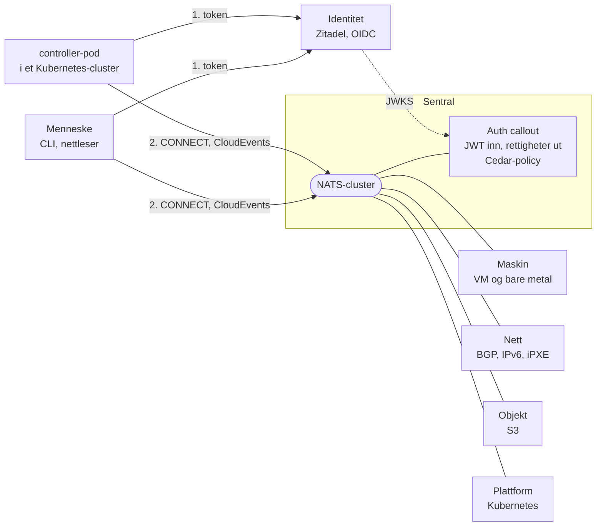
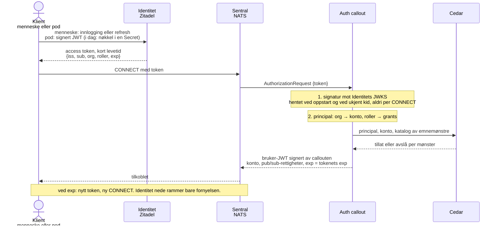
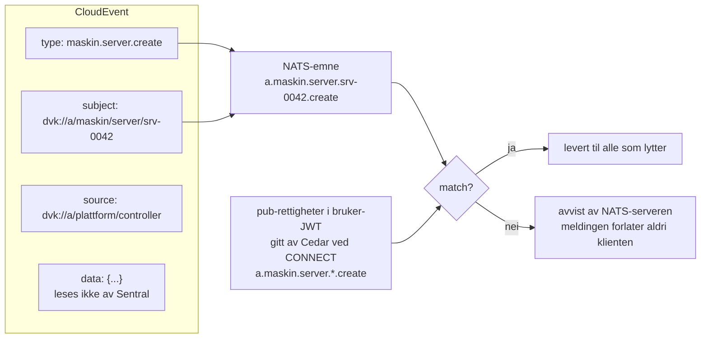
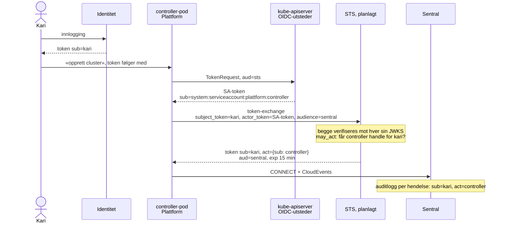
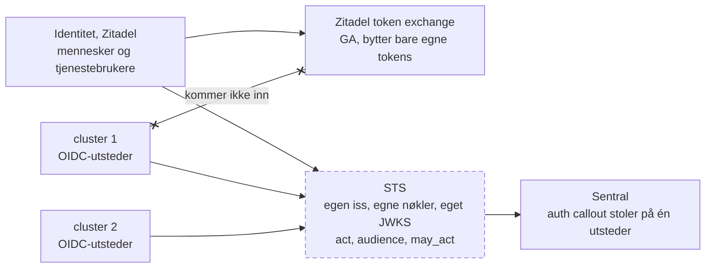

<!--
Skjelett. Tidsbudsjett, 45 minutter:
  0–5    Innledning, begge
  5–22   Kontrollplanet, Jan Ivar
  22–34  Salmon, Linus
  34–36  Ønskelisten, begge
  36–44  Spørsmål dem imellom: først tre om Salmon fra Jan Ivar, så tre om Dataverket fra Linus
  44–45  Publikum, eller avslutt
Skilleark har class skille, Q&A-bildene class sporsmal.
-->

# Maskiner som logger inn

Maskinidentitet, delegering og tillit med åpen kildekode

Containerkonferansen | Trondheim, 14. oktober 2026 | Jan Ivar Beddari og Linus Johansen

---

<!-- _class: skille -->

## Hvem er denne maskinen, og på vegne av hvem handler den?

Innledning, 5 minutter, begge

---

## Hvem er vi

- Jan Ivar: Dataverket, et åpent kontrollplan for suveren skyinfrastruktur
- Linus: salmon, en identitetsleverandør for mennesker og arbeidslaster

---

## Hvorfor spørsmålet haster nå

<!-- Agenter, orkestratorer og autonome arbeidslaster handler selv. -->

---

## Tre spørsmål

1. **Tenant-isolasjon**: kan kryss-trafikk gjøres kryptografisk umulig, ikke bare forbudt?
2. **Innlogging uten hemmeligheter**: kan kortlevde tokens erstatte statiske credentials?
3. **Delegering**: kan en maskinhandling spores tilbake til et menneske?

---

<!-- _class: skille -->

## Kontrollplanet

Jan Ivar, 17 minutter

---

## Dataverket på ett bilde

<!-- Go, AGPL. Alt snakker CloudEvents over NATS. Plattform er Kubernetes, så publikum ser seg selv i bildet. -->

---

## Én organisasjon er ett sikkerhetsdomene

<!-- Spørsmål 1. Et namespace er en policy-grense: RBAC og NetworkPolicy sier nei. En NATS-konto er en nøkkelgrense: et emne i A finnes ikke i B. Kryss-trafikk krever eksplisitt export/import, per emne. -->

Kubernetes: namespace er en policy-grense. NATS: konto er en nøkkelgrense.

---

## Innslipp: fra token til tilkobling

<!-- Spørsmål 2. Slått sammen fra de to BLUG-diagrammene. Poenget for k8s-folk: ingen Secret med langlevd nøkkel, callouten ringer ikke Identitet på den varme stien, og rettighetene lever like lenge som tokenet. Podens vei til et Identitet-token i dag er en nøkkel i en Secret, det er Hullet. -->

---

## Konvolutten bestemmer, ikke innholdet

<!-- Som RBAC: verb, ressurs og namespace avgjør, ikke spec-en. Her: type, ressurs-ID og org i CloudEvent-konvolutten avgjør, og Sentral leser aldri data. Emne- og ID-formatet er illustrasjon, ikke vedtatt. -->

RBAC avgjør på verb, ressurs og namespace. Sentral avgjør på type, ressurs-ID og org.

---

## Delegering med RFC 8693

<!-- Spørsmål 3. Operatormønsteret: en controller handler på vegne av et menneske. TokenRequest API gir poden et kortlevd SA-token med valgt audience, ingen Secret. STS er planlagt, ikke bygget. -->

---

## Hullet

<!-- Zitadels token exchange er GA, men bytter bare egne tokens. Clusterets SA-token kommer ikke inn. Kontrollplanet trenger egen STS: egen iss, egne nøkler, eget JWKS, og act, audience og may_act. Overgang til Linus: Salmon har formen. -->

Den stiplede boksen finnes ikke i dag. Linus har begynt å skrive den.

---

<!-- _class: skille -->

## Salmon

Linus, 12 minutter

---

## Hva salmon er

---

## Datamodellen

---

## Token exchange, flyten

---

## Hva som mangler

---

<!-- _class: skille -->

## Ønskelisten

Begge, 2 minutter

---

## Til det norske åpen kildekode-fellesskapet

- Modne delegeringsprofiler i identitetsplattformene
- Standardisert identitet for meldinger
- Gjenbrukbare byggeklosser i et kontrollplan

---

<!-- _class: skille -->

## Spørsmål

Dem imellom, 8 minutter. Først tre om Salmon, så tre om Dataverket.

---

<!-- _class: sporsmal -->

## Om Salmon, 1

<!-- Jan Ivar spør, Linus svarer. -->

---

<!-- _class: sporsmal -->

## Om Salmon, 2

<!-- Jan Ivar spør, Linus svarer. -->

---

<!-- _class: sporsmal -->

## Om Salmon, 3

<!-- Jan Ivar spør, Linus svarer. -->

---

<!-- _class: sporsmal -->

## Om Dataverket, 1

<!-- Linus spør, Jan Ivar svarer. -->

---

<!-- _class: sporsmal -->

## Om Dataverket, 2

<!-- Linus spør, Jan Ivar svarer. -->

---

<!-- _class: sporsmal -->

## Om Dataverket, 3

<!-- Linus spør, Jan Ivar svarer. -->

---

## Tre spørsmål, tre svar

1. Tenant-isolasjon:
2. Innlogging uten hemmeligheter:
3. Delegering:

Bli med i Dataverket: medlem@dataverket.org

<!-- Publikum tar over herfra, eller vi avslutter. -->
