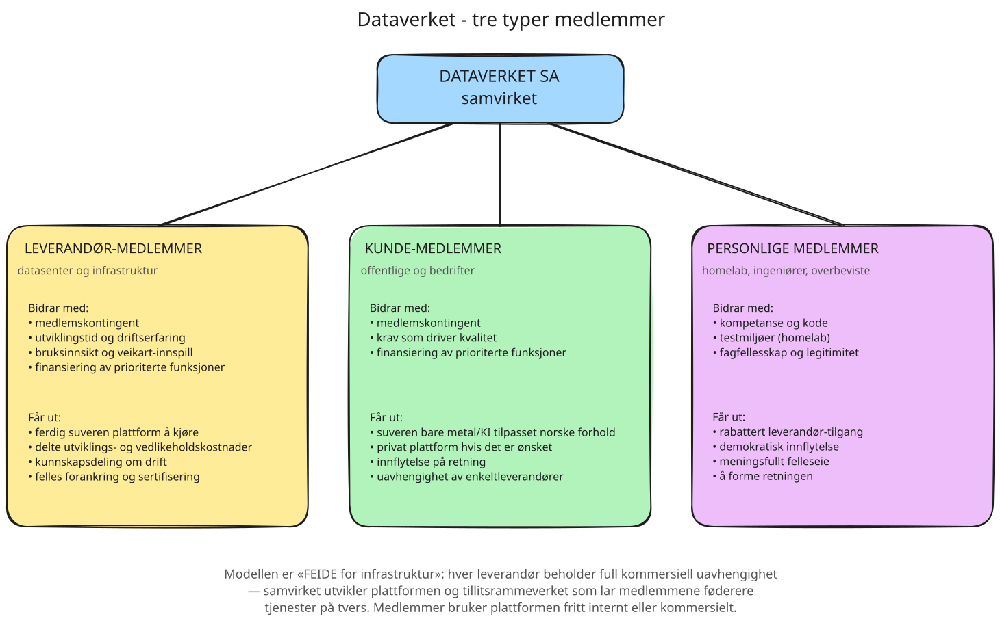

# Dataverket Nett og Maskin

## Bakgrunn

Norsk næringsliv og offentlig sektor trenger suveren infrastruktur, inkludert
KI-akselerert beregning under norsk og europeisk jurisdiksjon, uten å være
avhengig av amerikanske eller kinesiske skyleverandører. Dagens valg står stort
sett mellom hyperscalere (suverenitetstap) og selvbygget infrastruktur
(uoverkommelig for de fleste).

Dataverkets første leveranse vil gjøre det mulig å lukke dette gapet:

> **En åpen programvareplattform som lar norske datasenter-leverandører og
> infrastruktur-eiere tilby suveren bare metal og KI-cluster, utviklet og
> vedlikeholdt i fellesskap gjennom Dataverket-samvirket.**

Hver enkelt leverandør beholder full kommersiell uavhengighet og egne
kundeforhold. Samvirket eier ikke kapasitet og selger ikke tjenester. Det
utvikler plattformen og styrer tillitsrammeverket som lar medlemmene jobbe
sammen der det er nyttig.

## Modellen: «FEIDE for infrastruktur»

Den konseptuelle modellen er kjent fra norsk utdanningssektor.

**FEIDE** er den nasjonale identitetsføderasjonen som lar studenter og
ansatte bruke sin institusjonelle identitet på tvers av universiteter,
høgskoler og tjenester. Sikt (tidligere Uninett) eier ikke
identitetene, hver institusjon eier sine egne. Sikt drifter
protokollen, tillitsrammeverket og standardene som lar institusjonene
samhandle uten å være avhengige av hverandre.

Dataverket bygger samme mønster, men for *infrastrukturtjenester* på kryss av private og offentlige virksomheter:

- Hver datasenter-leverandør eier og drifter sin egen infrastruktur,
  med sine egne kunder.
- Samvirket eier *plattformen* og *tillitsrammeverket*: kode,
  standarder, sertifikater, tjenestekatalog-format, federasjons-API-er.
- Leverandører som kjører plattformen kan, hvis de ønsker, føderere
  identitet, ressurser og tjenester på tvers, slik at en kunde kan
  ha én identitet og se aggregert kapasitet hos flere norske
  leverandører gjennom samme portal.

Federasjon er en *mulighet* plattformen åpner for medlemmer, ikke en plikt.
Medlemmene velger fritt hvor mye de ønsker å samhandle.

## Forankring

Plattformen er teknisk forankret og tilpasset rammeverk som er aktuelle i Norge.

### EU og EØS

- **Cloud Sovereignty Framework v1.2.1**.
  Åtte suverenitetsmål (SOV-1 til SOV-8) brukt for å rangere skytjenester i
  europeiske offentlige anskaffelser.
  ([lokalt](forankring/Cloud-Sovereignty-Framework.pdf) | [ekstern link](https://commission.europa.eu/news-and-media/news/sovereign-cloud-framework-explained-2026-06-01_en))
- **Cyber Resilience Act, forordning (EU) 2024/2847**.
  Felles krav til cybersikkerhet for alle produkter med digitale elementer som
  omsettes i EØS, inkludert programvare og tilkoblede enheter. Krav om
  sikkerhet-by-design, CE-merking, SBOM, og vedlikehold gjennom hele produktets
  levetid (minimum fem år). Rapporteringsplikt for sårbarheter fra 11. september
  2026, full ikrafttredelse 11. desember 2027.
  ([lokalt](forankring/cra-eu-2024-2847.pdf) | [ekstern link](https://eur-lex.europa.eu/eli/reg/2024/2847/oj/eng))

### Norge

- **NSMs grunnprinsipper for IKT-sikkerhet v2.1**.
  Det nasjonale rammeverket for sikker drift av digitale tjenester.
  ([lokalt](forankring/NSMs%20Grunnprinsipper%20for%20IKT-sikkerhet%20v2.1.pdf) | [ekstern link](https://nsm.no/regelverk-og-hjelp/rad-og-anbefalinger/ta-i-bruk-grunnprinsippene/))
- **Nkoms datasenterveileder**.
  Veiledning til sikkerhets- og beredskapsbestemmelsene for datasenteroperatører
  i ekomloven og datasenterforskriften, som trådte i kraft 1. januar 2025.
  ([lokalt](forankring/datasenterveileder-nkom.pdf) | [ekstern link](https://nkom.no/datasenter/datasenterveileder))
- **DFØ MPS Cloud Reference Architecture v1.3**.
  Referansearkitektur for informasjonssikkerhet og personvern i skyavtaler for
  offentlig sektor, fra DFØs Markedsplass for skytjenester. Mapper mot NIS2,
  GDPR, ISO/IEC 27001:2022, NIST CSF v2.0, og skyspesifikke rammeverk (ISO
  27017, CSA-CCM, FedRAMP, BSI C5:2020).
  ([lokalt](forankring/dfo-mps-cloud-reference-architecture-v1.3.pdf) | [ekstern link](https://markedsplassen.anskaffelser.no/kunnskap-og-veiledning/informasjonssikkerhet-og-personvern/krav-til-informasjonssikkerhet-i-skyavtaler-referansearkitektur))

Forankringen er ikke markedsføring. Den styrer arkitekturvalgene i
plattformen, og er argumentasjonen overfor både leverandører og innkjøpere som *må* forholde seg til rammeverkene avtalemessig sett.

Når forankringen og de tekniske løsningene er gjort én gang i fellesskap,
slipper hver enkelt leverandør kostnadene med å tilpasse seg til den selv.

## Tre typer medlemmer i samvirket

Erfaringer fra lignende fellesskap med åpen kildekode sier at modellen kan
fungere bra dersom både leverandører, kunder og privatpersoner raskt kan finne
verdi. Felles for alle er at de er *brukere* av plattformen, som er samvirkets
økonomiske virksomhet.



## Hvordan en kunde får tilgang i praksis

Selv om samvirket ikke selger tjenester, gjør plattformen
leveransekjeden enkel. Den første flyten kan være:

```
   ┌─────────────────────────┐
   │ KUNDE                   │
   │ velger fra katalog,     │
   │ får dedikert leveranse  │
   └────────────┬────────────┘
                │ kjøper
                ▼
   ┌──────────────────────────────────────┐
   │ DATASENTER-LEVERANDØR (medlem)       │
   │ • eier rack, strøm, kjøling, nettverk│
   │ • eier serverne                      │
   │ • kjører Dataverket-plattformen      │
   └────────────┬─────────────────────────┘
                │  bruker
                ▼
   ┌───────────────────────────────────────┐
   │ DATAVERKET-PLATTFORMEN                │
   │ • utviklet og vedlikeholdt i samvirket│
   │ • forankret i relevante rammeverk     │
   │ • federasjons-API mot andre medlemmer │
   └───────────────────────────────────────┘
```

Den første salgbare allokeringsenheten bør være en *maskin*: én dedikert fysisk
server tilkoblet faste porter i et bestemt rack. Det gir kunden full fysisk
isolasjon, og leverandøren en klar enhet for prising og kapasitetsstyring.

I forhold til tradisjonelle colocation-modeller betyr denne modellen at kunden kan leie eller kjøpe servere, men ikke nettverk. Nettverk er en standardisert tjeneste som leveres av datasenter-leverandør helt til serverport. Dette muliggjør "bare metal as a service" og samme standardiserte løsning (BGP, IPv6, iPXE) for alle kunder.

Selvhostende kunde-medlemmer kjører plattformen selv. Det er samme bilde,
men der leverandør og kunde er samme organisasjon.

## Hva federasjon kan bli senere

Federasjons-rollen er åpen. Konkrete eksempler på hva samvirket *kan* utvikle
hvis medlemmene ønsker det:

- **Felles identitet**: en kunde-medlem logger inn med samme
  identitet hos flere leverandører.
- **Felles katalog**: en kunde ser tilgjengelig kapasitet på tvers av
  alle leverandører som ønsker å eksponere den.
- **Felles fakturering eller clearing**: leverandører kan tilby
  hverandres tjenester gjennom egen kundeavtale.
- **Felles audit-strøm**: kunder kan abonnere på sin egen
  audit-historikk på tvers av leverandører.

Alt dette er valgfritt. Hver leverandør deltar i den graden de selv
ønsker.

## Hvorfor dette som første produktløsning

- **Stort, tydelig hull i markedet.** Norsk, allment tilgjengelig og suveren
  KI-beregning finnes knapt i dag. Leverandørsamarbeid er et unntak og blir ikke sett på som en fordel. Det er vanskelig å komme i gang med en videre skalerbar modell om du ikke har erfaring.
- **Forankret begrunnelse.** Selger ikke "ny teknologi"; bygger målbar
  suverenitet etter norske og europeiske rammeverk. Dette er stadig viktigere i offentlige anskaffelser.
- **Smal skive med tydelig verdi.** Ingen medlemmer må forstå hele
  Dataverket-visjonen for å se hvorfor de vil bruke *dette*.
- **Lav inngangsbarriere for leverandører.** Plattformen legges som
  et lag ved siden av eksisterende drift, ikke som en erstatning.
- **Tre medlemstyper finner verdi.** Leverandører får delt kostnad og
  fellesplattform, kunder får suverenitet og innflytelse, personlige
  medlemmer får meningsfullt felleseie.
- **FEIDE-modellen er kjent og akseptert i Norge.** Den lar samvirket
  vokse uten å konkurrere med medlemmene.
- **Naturlig vei videre.** Senere produkter (VM-er, Kubernetes,
  objektlagring) skal bygges på samme grunnmur og teknologi.

## Spørsmål

Organisasjons-skissen reiser noen vedtekts-spørsmål.

### Formålsangivelse

Samvirkets virksomhet er å *utvikle og vedlikeholde programvareplattform og kunnskap til felles nytte for medlemmene*. Medlemmene samhandler med samvirket ved å *bruke* denne plattformen (avtakere). Holder denne formuleringen mot samvirkelovens krav?

### Differensierte medlemskategorier

Samvirkeloven krever ett medlem én stemme (eller gradert etter samhandling, ikke kapital). Hvordan formuleres vedtektene slik at tre svært forskjellige medlemstyper kan ha balansert innflytelse?

### Andelsinnskudd per medlemstype

Bør størrelsen variere (lav for personlige, høyere for organisasjoner)?

### Federasjons-rollen

Samvirket skal på sikt operere et tillitsrammeverk (sertifikater, identitet, katalog) som medlemmene bruker, hvordan formuleres dette i formålet uten å låse seg til en konkret framtid?

### Rettigheter ved oppløsning

Den planlagte ideelle stiftelsen er en naturlig mottaker av nettoformuen. Bør dette vedtektsfestes allerede nå selv om stiftelsen ikke er etablert?
